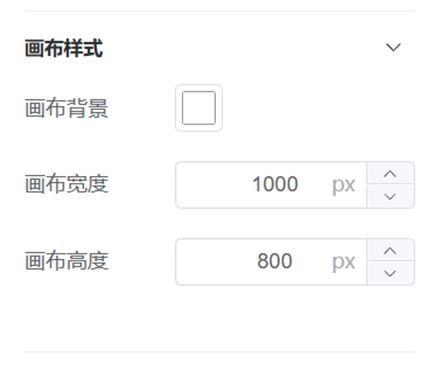
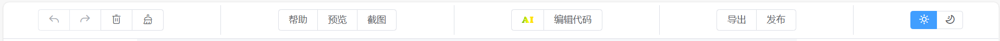

# Low Code Platform

## 简介

本项目是一个拖拽式可视化搭建前端页面的低代码平台，同时通过引入大语言模型，进一步简化开发流程，提升低代码平台的易用性。


## 环境部署

### 安装依赖

进入项目目录后，使用`npm install`命令安装所有依赖。

```
npm install
```

### 启动JSON Server

在 server 目录中，运行以下命令来启动 JSON Server：

```
npm run mock
```

### 本地开发

```
npm run dev
```

### 生产环境构建

```
npm run build
```


## 项目目录结构

```
Low-Code
│  
├─public
│      db.json
│      img.png
│      prompt.md
│      vite.svg
│      
├─server // json-server后端
│      db.json // 数据库文件
│      package.json
│      
└─src
    │  App.vue
    │  main.ts
    │  style.css
    │  vite-env.d.ts
    │  
    ├─assets
    │  │  canvas2image.js // canvas2image的npm包存在bug，故使用本地引入
    │  │  logo.png
    │  │  
    │  └─css
    │          base.css
    │          base.min.css
    │          base.scss // 全局基础样式
    │          dark.css // 黑夜模式样式
    │          icon.css // iconfont图标库样式
    │          
    ├─components
    │  │  index.ts
    │  │  
    │  ├─ComponentList // “左侧组件列表”组件
    │  │      ComponentList.tsx
    │  │      
    │  ├─ConfigMenu // “右侧属性设置”组件
    │  │      ConfigMenu.css
    │  │      ConfigMenu.min.css
    │  │      ConfigMenu.scss
    │  │      ConfigMenu.tsx
    │  │      
    │  ├─EditCanvas // “编辑画布”组件
    │  │      EditCanvas.css
    │  │      EditCanvas.min.css
    │  │      EditCanvas.scss
    │  │      EditCanvas.tsx
    │  │      renderElement.tsx
    │  │      
    │  └─ShowCanvas // 渲染画布组件
    │          renderElement.tsx
    │          ShowCanvas.tsx
    │          
    ├─http // http请求接口
    │      config.ts
    │      index.ts
    │      
    ├─interface // ts类型接口
    │      data.ts
    │      index.ts
    │      store.ts
    │      
    ├─router // 路由
    │      index.ts
    │      
    ├─store // pinia状态管理与持久化
    │      canvas.ts
    │      elements.ts
    │      index.ts
    │      publish.ts
    │      
    ├─utils // 工具函数
    │      bus.ts // bus总线
    │      deepcopy.ts // 深度拷贝函数
    │      registerCommand.ts // 注册操作命令
    │      registerComponent.tsx // 注册组件
    │      screenshots.ts // 截图
    │      throttle.ts // 节流函数
    │      useDragger.ts // 拖拽相关函数
    │      useExport.ts // 导出相关函数
    │      useMove.ts // 移动相关函数
    │      
    └─views // 页面
            HomePage.vue // 主页
            NotFound.vue // 空页面
            PreviewPage.vue // 预览页
```


## 软件使用手册

### 页面整体结构


> 页面中间为编辑器模块，左边为组件列表模块，右边为属性编辑模块，上方为工具栏模块。

### 编辑器模块


> 编辑器模块负责提供画布的显示、编辑、组件的拖拽、移动等功能。用户可以在编辑器模块中创建、修改和布局页面，实时预览设计效果。

### 组件列表模块


> 支持文本、按钮、输入框、图片、视频、线段这些基础组件，用户可以从组件列表中选择需要的组件，然后将其拖拽到编辑器模块中进行布局和编辑。

### 属性编辑模块



> 属性编辑模块负责提供画布和组件各项样式、属性等的编辑功能。用户可以在该模块中对选定的组件进行详细的属性设置，包括但不限于颜色、字体等方面的调整。

### 工具栏模块



> 工具栏模块负责承载其余所有功能模块，根据实现方式和主要用途，分为撤销/重做、删除组件、清空画布模块，帮助模块，预览、截图、导出、发布模块、AI生成模块以及昼夜模式模块。工具栏提供了快捷的访问方式，使用户可以方便地执行常用操作。

### AI生成模块


> 在AI对话界面发送需求后，平台会返回可直接使用的代码。双击代码可直接生成页面；单击代码可复制，复制后可在编辑代码窗口进行编辑。
